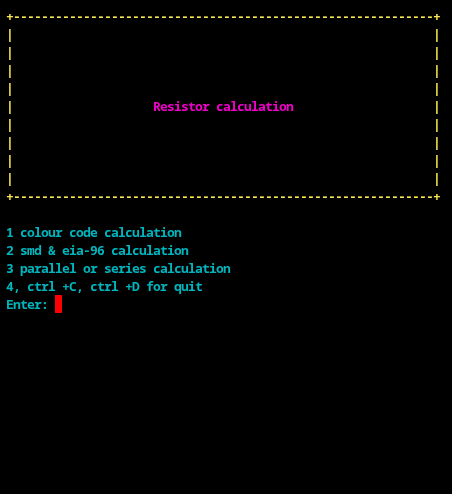
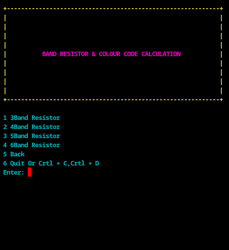
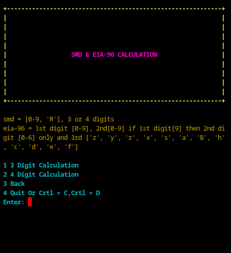
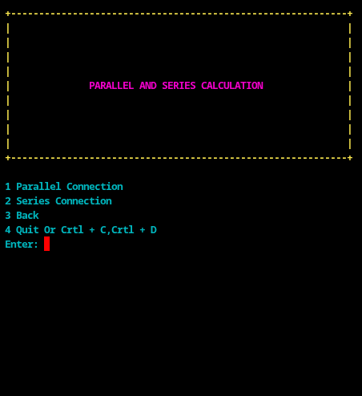

# Electronic

# run command
`python3 resistance_calculate.py`

---

## FULL GIF

## HOME PAGE Screenshot

---

# ✨ Features

## 🎨 Resistor Colour Code Calculator

> Decode 4-band, 5-band, and 6-band resistor colour codes into resistance values.

## 📦 SMD Resistor Code Decoder

> Supports standard SMD resistor markings.

## 📐 EIA-96 Code Calculator

> Converts EIA-96 resistor codes into accurate resistance values.

## 🔗 Series Resistor Calculation

> Calculates total resistance for resistors connected in series.

## ⚡ Parallel Resistor Calculation

> Computes equivalent resistance for parallel resistor networks.

## 🧰 Built With

> Pure Python

> No external libraries or dependencies required

## 🎯 Purpose

> This project is designed to provide an easy-to-use command-line utility for learning electronics and performing quick resistor calculations.

## 🚀 Ideal For

> Electronics students

> Embedded systems learners

> DIY circuit designers

> Beginners learning Python + electronics
